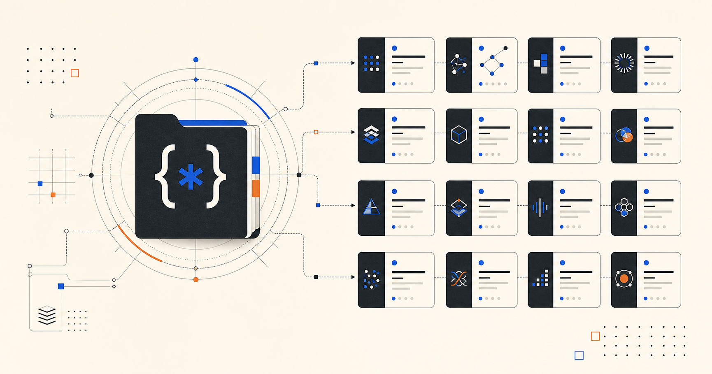

# AI Repo Directory

[](./docs/DATASET_V1.md)
[](./docs/DATASET_V1.md)
[](./LICENSE)

> A curated, independently verified directory of open-source AI repositories — searchable, transparent, and regularly refreshed.

**[Explore the directory](https://ai-repo-directory.github.io/ai-repo-directory/) · [Suggest a repository](../../issues/new/choose) · [Report a correction](../../issues/new/choose) · [Read the methodology](./RANKING_METHODOLOGY.md)**



Finding an AI project that is maintained, documented, and appropriate for real work should take less than a week of GitHub tabs. AI Repo Directory makes that research reviewable: every listing pairs practical editorial context with maintenance signals and a transparent discovery score.

## Why this is different

- **256 independently verified repositories** across 16 AI categories.
- **Useful discovery, not star chasing.** Rankings combine adoption, maintenance, activity, documentation, maturity, ecosystem, and practical usefulness.
- **Caveats included.** Stale, archived, source-available, and historically important projects are described honestly.
- **Shareable search.** Filter by category, language, license, maintenance, self-hosting, local/offline use, difficulty, and more.
- **Open and reviewable.** The catalog is versioned JSON, not an opaque database; weekly GitHub metadata refreshes happen in public.

## Categories

LLM inference · AI agents · coding agents · RAG · local AI · image AI · video AI · audio AI · training · evaluation · MCP tools · multimodal · datasets · infrastructure · research · vector databases

## Use it

Visit the live directory to explore the catalog. Every repository page explains what it is, why it matters, key trade-offs, and related tools. URL filters are deliberately shareable—send someone the exact shortlist you made.

The GitHub Pages URL above assumes the first-choice organization handle (`ai-repo-directory`). If the handle is unavailable at launch, update this single link and the Pages environment variables to the chosen organization URL.

## Contribute

This project improves through skeptical, sourced contributions.

- Suggest a missing repository with a clear rationale and canonical GitHub URL.
- Correct data, classifications, licenses, or maintenance signals with an authoritative source.
- Improve the website, tests, docs, or data tooling.
- Review the [contribution guide](./CONTRIBUTING.md), [data schema](./docs/DATA_SCHEMA.md), and [verification methodology](./docs/VERIFICATION_METHODOLOGY.md) before opening a pull request.

Please star the repository if the directory saves you research time. It helps other developers find a maintained alternative to star-sorted lists.

## Local development

```bash
pnpm install
cp .env.example .env.local
pnpm dev
```

Useful checks:

```bash
pnpm validate
pnpm typecheck
pnpm lint
pnpm test
pnpm build
```

For a GitHub Pages-compatible build locally:

```bash
NEXT_PUBLIC_SITE_URL=https://ai-repo-directory.github.io/ai-repo-directory \
NEXT_PUBLIC_BASE_PATH=/ai-repo-directory \
pnpm build
```

## Data and ranking

The catalog is curated rather than exhaustive. It does **not** claim real-time GitHub data or star-growth trending until enough historic snapshots exist. See [Dataset v1](./docs/DATASET_V1.md), [data provenance](./DATA_PROVENANCE.md), and the [ranking methodology](./RANKING_METHODOLOGY.md) for the exact claims and trade-offs.

## License

MIT for the directory code and editorial metadata. Listed projects retain their own licenses.
